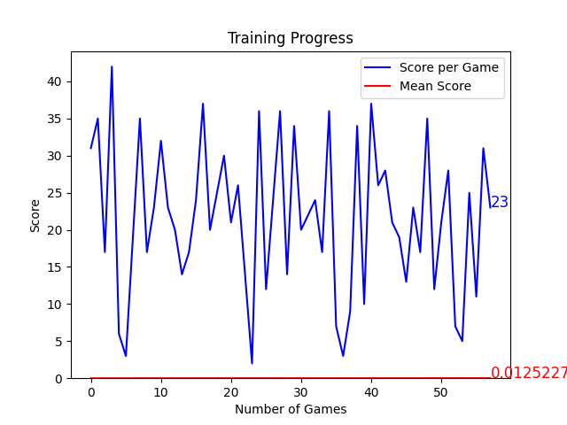

# 🐍 Snake AI - Deep Q-Learning with Pygame

This project is an **AI-powered Snake game** that uses **Deep Q-Learning (DQN)** to train itself to play and improve over time. The AI **learns from experience**, using rewards and penalties to make better decisions with every game.



## 🚀 Features
✅ **Deep Q-Learning** - The AI trains using a neural network.  
✅ **Experience Replay** - AI remembers past moves to improve decision-making.  
✅ **Custom Reward System** - Encourages efficient movement and higher scores.  
✅ **Graph Visualization** - Live tracking of AI performance.  
✅ **Auto-Save & Resume** - Training progress is saved and can be resumed.  

## 📌 How It Works
The AI observes the game state and predicts the **best action** (left, right, or straight) based on previous experiences. It learns using **reinforcement learning**.

- 🎯 **Goal:** Maximize the score while avoiding collisions.  
- 🧠 **Neural Network:** Predicts the best move based on game state.  
- 💡 **Training:** AI improves by replaying past experiences and adjusting its behavior.  

## 🔧 Installation & Setup (Mac/Linux)
### 1️⃣ Install Python & Dependencies
First, ensure you have **Python 3.10+** installed. Then, install the required dependencies:
```bash
pip install pygame torch numpy matplotlib
/**
 * ## Run the AI
 * 
 * To start the AI, use:
 * 
 *     python agent.py
 * 
 * ## View Training Progress
 * 
 * A live graph updates in real-time as the training proceeds.
 * 
 * ## Improvements
 * 
 * - **Better Reward System:** The AI now receives higher rewards for strong performance and penalties for actions that do not contribute to success.
 * - **Loop Prevention:** By avoiding repetitive moves, the AI maintains efficiency.
 * - **Faster Learning:** Epsilon decay helps reduce randomness over time.
 * - **Smart Experience Replay:** Important past experiences are prioritized, accelerating AI learning.
 * 
 * ## Training Performance
 * 
 * The AI gradually learns to survive longer with more effective decision-making. Over time, it refines its strategies and improves performance with the assistance of replaying critical experiences.
 */

 